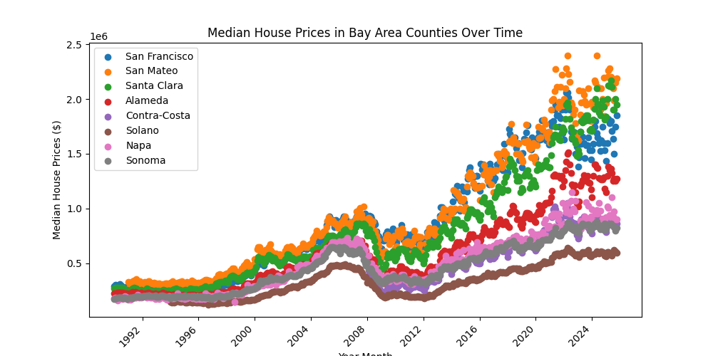
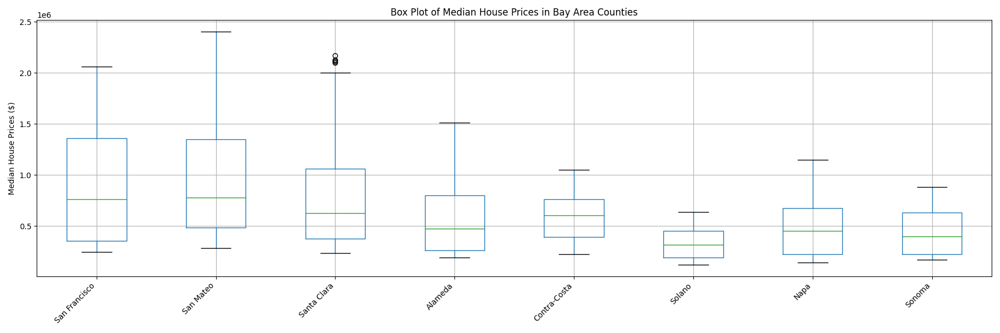

# 1. Introduction

I am interested in how housing cost has changed over time in California, and more specifically in these 9 Bay Area Counties: San Francisco, San Mateo, Santa Clara, Alameda, Contra-Costa, Solano, Napa, Sonoma. 

Will perform some time series analysis to identify any trends or seasonaility in the data to help build a forecasting model. 

## Variables of Interest

Response Variable: Average House price per county

Predictors
1. Population
2. Income per capita
3. Geographic area (census)
4. Temporal spread (annual historic to present)
5. Crime rate 

## Questions of interest

1. What is the general trend, is it same in Bay Area counties vs others
2. Is there a change point in the data for Bay Area homes, is that observed in other counties

## Tools
Time series analysis  
Correlation Matrix   
Regression 

# 2. Exploratory Data Analysis

## One graph with data for all bay area counties over time

## Boxplot showing the distribution for all 9 counties

## Dataset Summary

Dataset: Median Prices of Existing Detached Homes California  
Source: Califronia Association of Realtors, https://www.car.org/marketdata/data/housingdata

NaN Values: 
- San Mateo: 12 NaN values
- Contra-Costa: 192 NaN values
- Solano: 49 NaN values

## Data Info

RangeIndex: 430 entries, 0 to 429  
Data columns: total 64 columns  
dtypes: float64(59), int64(5)  
memory usage: 215.1 KB

